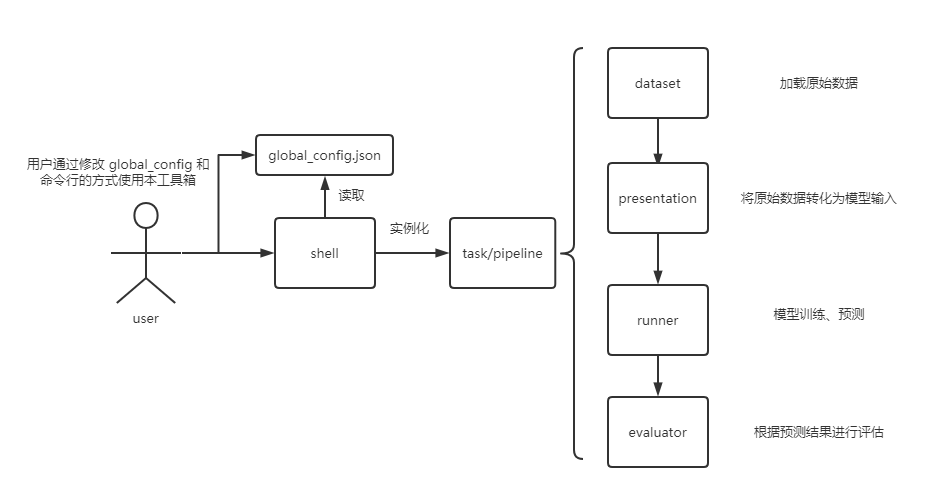

## 架构说明

#### 流程图

#### 类图

#### 关于 config

项目有两处存放 config 的地方，一个是 `root/global_config.json` 用于存放全局配置，用户可以通过在该配置文件中向各阶段添加参数进行微调。另一个是 `root/config/阶段名/xxx.json` 存放每个类对应的默认参数配置，每个类实例化时会读取该配置文件，再接受从外部传来的 global_config 完成参数初始化。

>因为 global_config.json 是每个用户（开发人员）都会进行修改的文件，故不加入 git 中，取而代之将 global_config_sample.json 作为样例加入。用户可自行根据该 json 创建自己的 global_config.json。

#### 关于 dataset

并没有废除该类，而是将该类的实例化与使用交给了 presentation 类来完成。因为考虑到之后下载数据集也会由该类完成。

#### 关于 cache 的命名规则

表示层的 cache 命名为： `root/runtimeFiles/preCache/xxx_{datasetName}{parameter_str}.json` ，其中 xxx 为该 pre 的名字（具有区别性即可），parameter_str 为当前表示层参数拼接成的一个字符串（如_1_2_3）

模型 cache 命名：`root/runtimeFiles/save_model/{modelName}_{preName}_{datasetName}.m`

